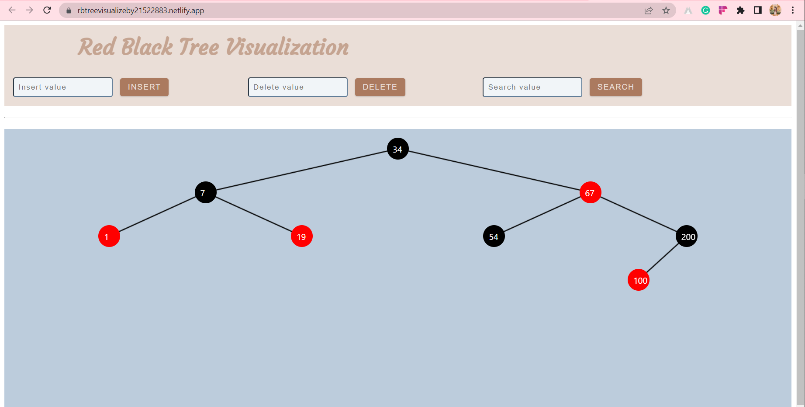
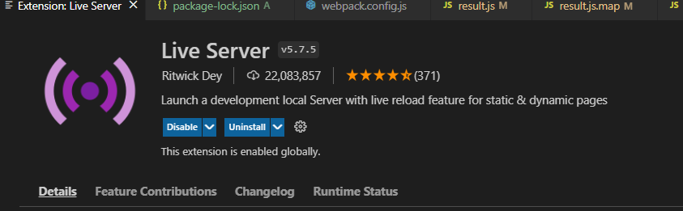

# Red Black Tree Visualizer using JS, HTML amd CSS.

Insert works, Delete and Search only works with nodes having leaf son nodes (fixing positively).

I changed the color and font so it may appear different from the UI in report.

You can access the web here: https://rbtreevisualizeby21522883.netlify.app or clone this project and run directly on your localhost (try VSC extension.) with instructions bellow.

## Instruction: How to use this project?

### Start your experience on deployed site
You can visit: https://rbtreevisualizeby21522883.netlify.app to start on my deployed site.

Step 1: Add your own first value as RB Tree nodes by enter a value (must be a number) and click on "Insert". Go on entering your next values, one by one, then you see the web proceeded the RB Tree for you.

Step 2: If you want to delete a node, enter its number and click on Delete.

Step 3: Search works the same way.

#### Your active site should look like this: 

### Or, run directly on your localhost
You can also run this project on your localhost. There are many ways to do this but here I suggest going live with Visual Studio Code (VSC) with only one extension.

Step 1: Download ZIP/Clone this project onto your device.

Step 2: Start Visual Studio Code session and open the folder containing this project on your device.

Step 3: Open the extension tab, search for this extension and start installing it.

Step 4: Open your terminal, type 'npx webpack', this helps the program collects all your codes and write them to 'result.js' to start activating. If your terminal needs you to do some additional steps, just follow them.

Step 5: Next, look to your bottom right corner of VSC application and find the text displaying your port, click on it.

Step 6: You will see the button 'Go  Live' display for you at the position that your port information was displayed. Click on "Go Live'.

Step 7: The program will immediately direct you to the site with your localhost. The appearance of the web is exactly the same!

## Furthermore, all information about this project is written in document/report.pdf. You can find it in this repo. Have fun and don't hesitate to send me some review if you see any unreasonable things here. <3
